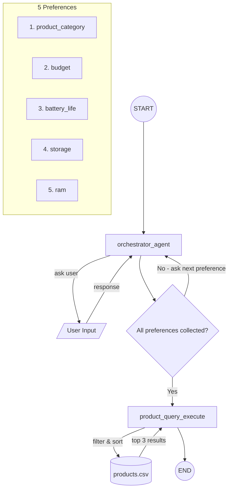

# Product Recommendation Chatbot

An AI-powered chatbot that collects user preferences through conversation and recommends Apple products using Claude and LangGraph.


## File Overview

| File | Description |
|------|-------------|
| `server.py` | FastAPI server that manages chat sessions and exposes `/start` and `/chat` endpoints for the frontend. |
| `chatbot.py` | LangGraph-based conversational agent that uses Claude to collect user preferences and query a product database for recommendations. |
| `index.html` | Single-page chat UI that renders the conversation and displays recommended products as styled cards with Amazon search links. |
| `products.csv` | Dataset of 30+ Apple products (laptops, phones, tablets, wearables, etc.) with specs like price, battery life, RAM, and storage. |


## Brief Explanation

1. **Session start** -- The user opens the page, triggering a `GET /start` call that creates a new session and invokes the LangGraph graph with an initial greeting.
2. **Preference collection** -- The `orchestrator_agent` node sends the conversation to Claude with a system prompt instructing it to ask about preferences one at a time: product category, budget, battery life, storage, and RAM.
3. **User interaction loop** -- Each user message is sent via `POST /chat`, appended to the conversation history, and passed back through the orchestrator. Claude validates answers and asks the next question.
4. **Preference extraction** -- After all 5 preferences are collected, Claude responds with a structured JSON block. The `extract_preferences` function parses this into a Pydantic-validated `UserPreferences` object, ensuring each preference value matches the expected options.
5. **Conditional routing** -- The `should_query_products` edge checks if preferences are complete. If yes, it routes to `product_query_execute`; otherwise the conversation continues.
6. **Product recommendation** -- `product_query_execute` filters `products.csv` by category, sorts by the user's stated preferences (high/low), and returns the top 3 matches.
7. **Results display** -- The server returns the product list to the frontend, which renders each product as a card with specs and an Amazon search link.

## Conversational Flow Chart



## Chatbot in Action

**Staying on track with product selection** -- If the user tries to ask for something outside the supported product categories, the chatbot redirects them back to the available options.


**Keeping preferences on topic** -- While collecting a specific preference, the chatbot won't advance if the user goes off-topic. It also allows selecting "No Preference" for any category.


**Semantic understanding** -- You don't need to type exact category names. The chatbot uses semantic understanding to figure out what you mean from natural language.


**Built-in guidance** -- If you're unsure what to pick, the chatbot gives advice and answers general questions to help you decide.


**Changing your mind** -- If you change your preferences midway through the conversation, the chatbot lets you retroactively update them before finalizing recommendations.


## Local Setup

1. **Clone the repo:**
   ```bash
   git clone https://github.com/rohitk2/product_recommendation_chatbot.git
   cd product_recommendation_chatbot
   ```

2. **Install dependencies:**
   ```bash
   pip install -r requirements.txt
   ```

3. **Create a `.env` file** in the project root with your API key:
   ```
   ANTHROPIC_API_KEY=your_key_here
   ```

4. **Start the server:**
   ```bash
   uvicorn server:app --reload
   ```

5. **Open** [http://localhost:8000](http://localhost:8000) in your browser.
